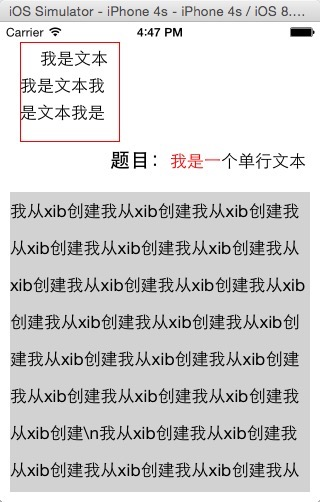

# CoreLabel
你想要的功能，都在这里了

    Charlin出框架的目标：简单、易用、高度封装、绝对解耦！

#CoreLabel
####你想要的功能，都在这里了。

####框架特性： 
>1.简单了NSMutableAttributedString及NSMutableParagraphStyle！ 
>2.添加了常用的功能：垂直对齐 
>3.支持区域样式，你无需关心实现过程，只需要设置对应的值以及range即可 
>4.支持代码创建，xib创建。 
>5.代码简洁，属于轻量级。 

####重要代码： 
    typedef enum VerticalAlignment {
    
    /**
     *  顶部对齐
     */
    CoreLabelVerticalAlignmentTop=0,
    
    /**
     *  垂直居中
     */
    CoreLabelVerticalAlignmentMiddle,
    
    /**
     *  底部对齐
     */
    CoreLabelVerticalAlignmentBottom,
    
    
     } CoreLabelVerticalAlignment;
  
  
  
  
  
      /**
       *  垂直对齐方式
       */
      @property (nonatomic, assign) CoreLabelVerticalAlignment verticalAlignment;
      
      
      
      
      /**
       *  样式
       */
      @property (nonatomic,strong) NSMutableParagraphStyle *style;
      
      
      
      
      /**
       *  直接设置样式，不会导致界面UI变化，需要手动调用更新
       */
      -(void)updateLabelStyle;
      
      
      
      /**
       *  设置颜色
       *
       *  @param color 颜色
       *  @param range 范围
       */
      -(void)setColor:(UIColor *)color range:(NSRange)range;
      
      
      
      /**
       *  设置字体
       *
       *  @param font  字体
       *  @param range 范围
       */
      -(void)setFont:(UIFont *)font range:(NSRange)range;
      
      
####使用说明： 
     /**
     *  代码创建
     */
    -(void)code{
        
        CoreLabel *label=[[CoreLabel alloc] initWithFrame:CGRectMake(20, 20, 100, 100)];
        
        label.layer.borderColor=[UIColor redColor].CGColor;
        label.layer.borderWidth=1.0f;
        
        label.text=@"我是文本我是文本我是文本我是文本我是文本";
        
        [self.view addSubview:label];
        
        //修改对齐
        label.verticalAlignment=CoreLabelVerticalAlignmentBottom;
    
        //设置行
        label.numberOfLines=0;
        
        //设置首行缩进
        label.style.firstLineHeadIndent=20;
        
        //行间距
        label.style.lineSpacing=10;
    
        //段间距
        label.style.paragraphSpacing=20;
        
        //更新
        [label updateLabelStyle];
       }
      
      
       /**
       *  从xib创建
       */
       -(void)xibCoreLabel{
        
        //修改对齐
        _label2.verticalAlignment=CoreLabelVerticalAlignmentBottom;
        
        //间距
        _label2.style.lineSpacing=20;
        
        //更新
        [_label2 updateLabelStyle];
        
       }
    
      /**
       *  颜色处理
       */
    -(void)colorHandle{
        
        [_label3 setColor:[UIColor redColor] range:NSMakeRange(3, 3)];
        
        [_label3 setFont:[UIFont boldSystemFontOfSize:20] range:NSMakeRange(0, 3)];
        
     
       }

#效果图：

    

-----
    CoreLabel 你想要的功能，都在这里了。
-----

  

#### 版权说明 RIGHTS  
作品说明：本框架由iOS开发攻城狮Charlin制作。 
作品时间： 2015.03.26 17:00 

#### 关于Chariln INTRODUCE  
作者简介：Charlin-四川成都华西都市报旗下华西都市网络有限公司技术部iOS工程师！  

#### 联系方式 CONTACT  
Q    Q：1761904945（请注明缘由） 
Mail：1761904945@qq.com 
