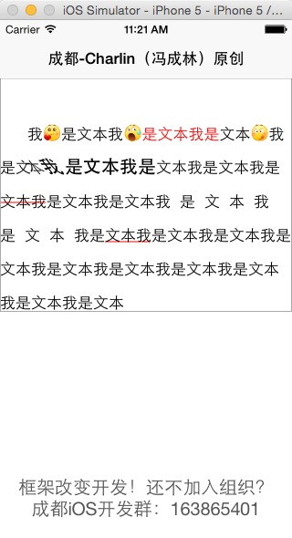

    Charlin出框架的目标：简单、易用、高度封装、绝对解耦！

#CoreLabel
####为图文混排而设计，超轻量级的Label。

   
#### 友情提示 MENTION 
Charlin（成都）更多原创项目（涵盖了方方面面，看看还有没有你需要的）： 
首页：https://github.com/nsdictionary 
列表：https://github.com/nsdictionary?tab=repositories 
成都iOS开发群：163865401（Charlin创建与维护，欢迎加群交流！） 
   

#效果图：

  

####框架特性： 
>1.封装并简化了NSMutableAttributedString及NSMutableParagraphStyle！ 
>2.添加了常用的功能：垂直对齐 
>3.支持区域样式，你无需关心实现过程，只需要设置对应的值以及range即可 
>4.支持代码创建，xib创建。 
>5.代码简洁，属于轻量级。 
>6.新增多种样式，主要增加了图文混排，让添加图片更新简单。 

  

####使用说明： 
 
###### 对齐方式
        //修改对齐
        label.cl_verticalAlignment=CoreLabelVerticalAlignmentBottom;
 

###### 基本属性
        //设置行间距
        label.cl_lineSpacing=20;
        
        //设置首行缩进
        label.cl_firstLineHeadIndent = 30;

 
###### 颜色 value：颜色值
     [label addAttr:CoreLabelAttrColor value:[UIColor redColor] range:NSMakeRange(5, 5)];   
    
 
###### 字体及加粗 value：字体
     [label addAttr:CoreLabelAttrFont value:[UIFont boldSystemFontOfSize:20] range:NSMakeRange(16,6)];
 
###### 倾斜 value：倾斜度数，请封装为NSValue，且可以使用度数宏定义
     [label addAttr:CoreLabelAttrObliqueness value:@(degree(-45)) range:NSMakeRange(15, 2)];

 
###### 字间距 value：间距值，请封装为NSValue
     [label addAttr:CoreLabelAttrKern value:@(10) range:NSMakeRange(40, 8)];

 
###### 删除线 value：删除线颜色
     [label addAttr:CoreLabelAttrDeleteLine value:[UIColor redColor] range:NSMakeRange(30, 3)];

 
###### 下划线 value：下划线颜色
     [label addAttr:CoreLabelAttrUnderLine value:[UIColor redColor] range:NSMakeRange(50, 3)];

 
###### 图文混排  size：图片大小，如果为CGSizeZero，由自动算为行高大小，offset为偏移量 location为你想插入的位置
        //添加一张图片
        [label addImage:[UIImage imageNamed:@"d_aini"] size:CGSizeMake(0, 0) offset:UIOffsetMake(0, -3) location:1];
        
        //添加一张图片
        [label addImage:[UIImage imageNamed:@"d_chijing"] size:CGSizeMake(0, 0) offset:UIOffsetMake(0, -3) location:5];
        
        //添加一张图片
        [label addImage:[UIImage imageNamed:@"d_chanzui"] size:CGSizeMake(0, 0) offset:UIOffsetMake(0, -3) location:12];

 
######  更新样式，请最后再调用
        //更新
        [label updateLabelStyle];

    

-----
    CoreLabel 为图文混排而设计，超轻量级的Label。
-----

  

#### 版权说明 RIGHTS  
作品说明：本框架由iOS开发攻城狮Charlin制作。 
作品时间： 2015.03.26 17:00 
更新时间： 2015.06.3 17:00 

#### 关于Chariln INTRODUCE  
作者简介：Charlin-四川成都华西都市报旗下华西都市网络有限公司技术部iOS工程师！  

#### 联系方式 CONTACT  
Q    Q：1761904945（请注明缘由） 
Mail：1761904945@qq.com 
